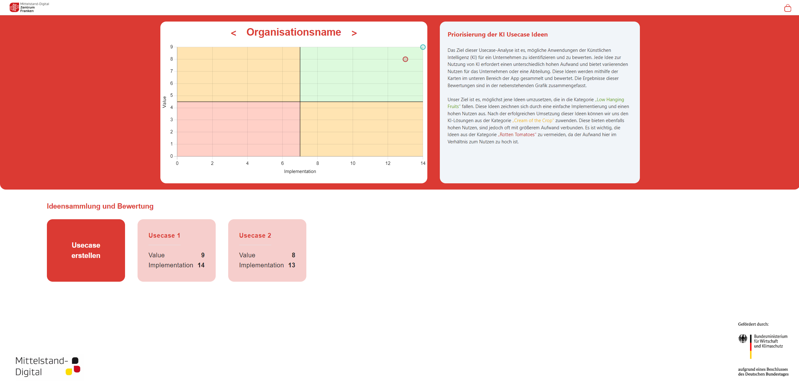
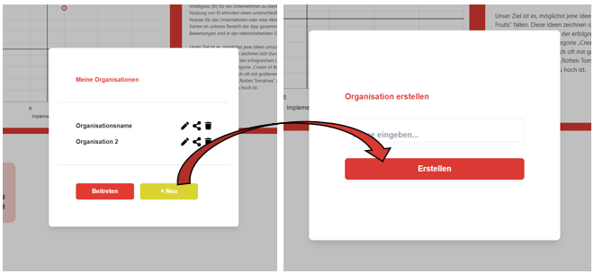
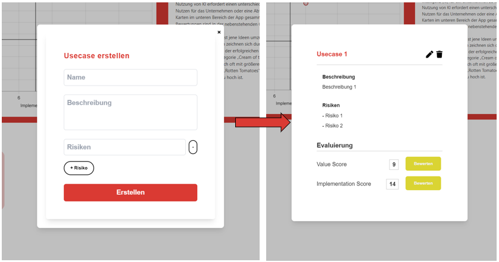
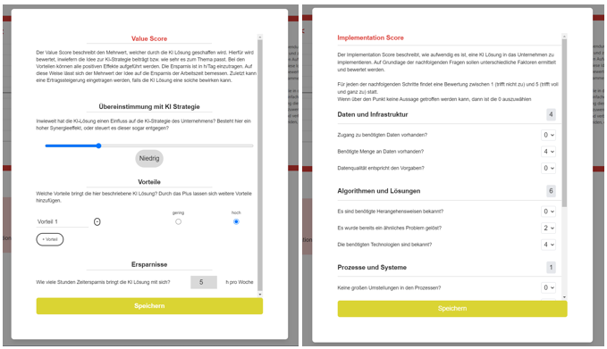
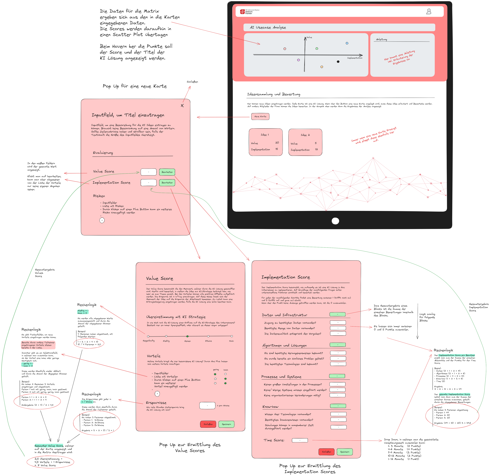
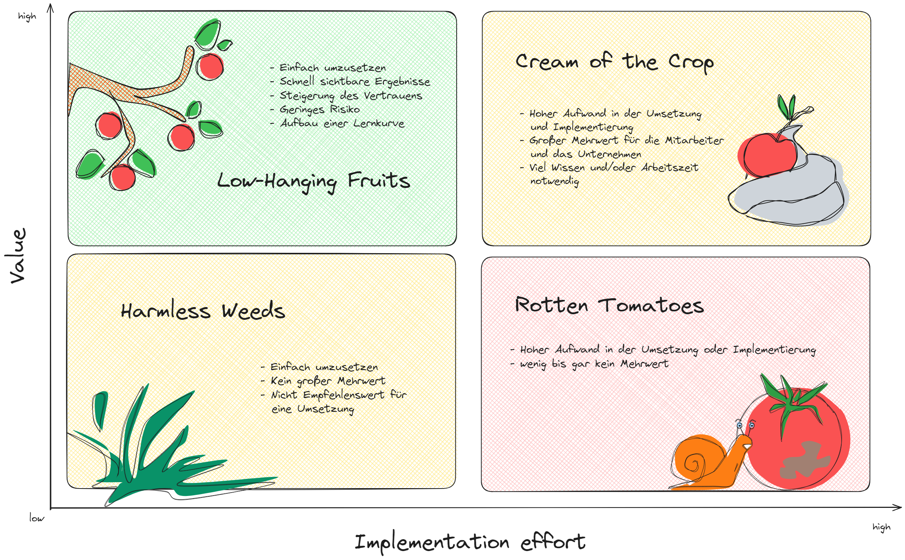
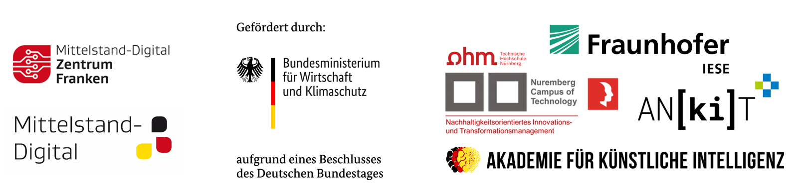

<!-- PROJECT LOGO AND TITLE-->
<h1 align="center">
   
  
   
  AI Usecase Analyse
   
</h1>
<h4 align="center">Der einfache Weg eure AI Anwendungsfälle zu Evaluieren <a href="" target="_blank">Link zum Test</a>.</h4>

<!-- LINKS -->

  
  
  
  

<!-- TABLE OF CONTENTS -->

  <a href="#about-the-project">About the Projekt</a> •
  <a href="#how-to-use">How To Use</a> •
  <a href="#logic">Logic</a> •
  <a href="#contact">Contace</a> •
  <a href="#partner">Partner</a>

<!-- Oberfläche -->

<!-- ABOUT THE PROJECT -->
## About The Project

Der Einsatz von KI ist für Unternehmen wichtig, da sie repetitive Aufgaben automatisieren und somit die Effizienz erheblich steigern kann. Durch die Analyse großer Datenmengen ermöglicht KI fundiertere Entscheidungen und verbessert die Geschäftsstrategien. Personalisierte Kundenerlebnisse werden durch KI-gesteuerte Empfehlungen und Analysen optimiert, was die Kundenzufriedenheit erhöht. KI hilft Unternehmen, innovativ zu bleiben und Wettbewerbsvorteile zu erlangen, indem sie schnellere Anpassungen an Marktveränderungen ermöglicht. Schließlich trägt KI zur Kostenreduktion bei, indem sie Prozesse optimiert und Ressourcen effizienter nutzt.

Aber bei all den Vorteilen durch den Einsatz von KI, kann dessen Implementierung ungeahnte Risiken mitsichbringen:
* Die Einführung von KI-Systemen kann erhebliche Zeit und Ressourcen erfordern, was zu hohen Anfangsinvestitionen führt
* Ein Mangel an internem Fachwissen und Expertise kann die erfolgreiche Implementierung und Nutzung von KI behindern
* KI-Systeme verarbeiten oft sensible Daten, was bei unzureichender Sicherheitsinfrastruktur zu Datenschutzverletzungen führen kann
* Unternehmen könnten von externen Anbietern und deren Technologien abhängig werden, was Flexibilität und Kontrolle einschränken kann
* Der Einsatz von KI wirft ethische Fragen auf

 

💡Daher haben wir ganz nach dem Leitsatz

> "Verschwende keine Zeit mit KI um der KI willen. Lass dich von dem motivieren, was sie für dich tun wird, nicht davon, wie sehr sie nach Science-Fiction klingt.“ 
   Cassie Kozyrkov, Chief Decision Scientist bei Google

die AI Usecase Analyse in Anlehung an das Paper `Wie man KI-Anwendungsfälle identifiziert und priorisiert` von <a href="https://www.appliedai.de/insights/how-to-find-and-prioritize-ai-use-cases">AppliedAI</a> entwickelt. Mit unserem Tool lassen sich KI Lösungen im Team Sammeln, Bewerten und die, für das Unternehmen, besten Ansätze identifizieren.

 

(<a href="#readme-top">back to top</a>)

<!-- HOW TO USE -->
## How to use
Die Anwendung der AI Usecase Analyse ist äußerst benutzerfreundlich. Mithilfe von Popups wirst du schnell und unkompliziert durch unseren Evaluierungsprozess geführt. Die Ergebnisse der Evaluierung werden in der obenstehenden Matrix dargestellt. Jeder Punkt repräsentiert eine potenzielle KI-Lösung. Wenn du mit der Maus über einen dieser Punkte fährst, werden zusätzliche Details zu dieser Lösung angezeigt.

Im Folgenden werden die vier wichtigsten Aktion Schritt für Schritt erläutert:
-	Anlegen einer Organisation
-	Anlegen einer neuen Karte zur Evaluierung einer KI-Lösung
-	Bewertung einer KI-Idee

 

### Anlegen einer Organisation

Für eine bessere Überschaubarkeit und die Trennung von Abteilungen/Teams, da die Evaluierung der KI Lösungen von Abteilung zu Abteilung unterschiedlich aufallen kann, lassen sich unterschiedliche Organisationen erstellen:

1. Klick auf die Überschrift der Evaluierungsmatix
2. Auswählen einer bestehenden Organisation oder erstellen einer neuen Organisation
3. Teilen der Organisation durch das Kopieren des Links über den entsprechendne Button
4. Bearbeiten des Organisationstitels durch klicken auf das Stift Icon
5. Löschen der Organisation durch klicken auf das Mülleimer Icon

### Anlegen einer neuen Karte zur Evaluierung einer KI-Lösung

Um den Evaluierungsprozess für KI-Lösungen zu erleichtern, werden diese in einzelnen Karten gespeichert, welche die Ergebnisse zusammenfassen und erläutern.

1. Durch einen Klick auf den Button „Neue Karte“ öffnet sich das erste von insgesamt drei Popup-Feldern.
2. Gib eine Überschrift ein, die die KI-Lösung prägnant beschreibt.
3. Trage eine detaillierte Beschreibung der KI-Lösung ein.
4. Klicke auf den Button „Bearbeiten“ beim Value Score, um die positiven Auswirkungen zu bewerten (siehe Anleitung weiter unten).
5. Klicke auf den Button „Bearbeiten“ beim Implementation Score, um den Implementierungsaufwand zu bewerten (siehe Anleitung weiter unten).
6. Fülle mögliche Risiken aus.
7. Bewerte die aufgeführten Risiken: Falls ein Risiko besonders schwerwiegend ist, kann die Checkbox aktiviert werden. In der Matrix erscheint dann ein Ausrufezeichen bei dieser KI-Lösung.
8. Speichere die Ergebnisse durch einen Klick auf den Button „Speichern“.

### Bewertung einer KI-Idee
Nachdem die Karten mit den einzelnen KI Lösungen erstellt wurden, müssen diese von dem gesammten Team bewertet werden. Jede Meinung und jerder Blickwinkel ist hier sehr wertfoll, wodurch die Evaluierung mit jeder abgegebenen Berwertung an Aussagekraft gewinnt. Für die Bewertung der KI Lösungen sind folgende Schritte durchzuführen:

#### Bewertung des Value Scores
Der Value Score beschreibt den Mehrwert der KI Lösung für das Unternehmen. Hierrunter
1.  Öffnen der Karte für die KI Lösung, welche bewertet werden soll
2.  Klick auf den Button "Bearbeiten" hinter dem Punkt "Value Score"
3.  Wähle mithilfe des Siders aus, wie gut die KI Lösung zu der Digitalisierungsstrategie des Unternehmens oder der Abteilung passt
4.  Füge Vorteile, die mit der KI Lösung einhergehen in die dafür vorgesehenen Felder und bewerte deren Gewichtung
5.  Schätze die zu erwartende Zeitersparnis in deinem Arbeitsbereich, welche durch die Implementierung der Lösung erzielt wird

#### Bewertung des Implentation Scores

1.  Öffnen der Karte für die KI Lösung, welche bewertet werden soll
2.  Klick auf den Button "Bearbeite" hinter dem Punkt "Implementation Score"
3.  Für die Bewertung des Implementation Scores werden eine ganze Reihe von von Fragen gestellt, welche mit Werten zwischen 0 und 5 bewertet werden können (0 = trifft nicht zu, 5 = trifft voll und ganz zu)
4.  Des weiteren muss eingeschätzt werden wie lange es dauern würde die KI Lösung zu implementieren (Dies kann über das Dropdown ausgewählt werden)

#### Ergänzung der Risiken
1.  Öffnen der Karte für die KI Lösung, welche bewertet werden soll
2.  Ganz unten lassen sich mögliche Risiken ergänzen
3.  Falls ein Risiko besonders schwerwiegend ist, kann die Checkbox aktiviert werden

 

(<a href="#readme-top">back to top</a>)

<!-- LOGIC -->
## Logic

Diese App ermöglicht eine systematische Bewertung und Visualisierung von AI Usecases. Die Rechenlogik basiert auf gewichteten Unterkriterien, die sowohl den Nutzen als auch die Umsetzbarkeit eines Usecases bewerten. Die Ergebnisse helfen dabei, die relevantesten und am besten umsetzbaren AI Usecases zu identifizieren und zu priorisieren.
Hierfür wird ein Value Score und ein Implementation Score basierend auf verschiedenen Kriterien ermittelt:

## Value Score:
Der Value Score setzt sich aus drei Kriterien zusammen:
-	Übereinstimmung mit der KI Strategie
-	Vorteile und deren Gewichtung
-	Eingesparte Zeit durch die KI Lösung

Die Übereinstimmung mit der KI-Strategie wird über einen Schieberegler festgelegt. Je besser die KI-Lösung mit der Unternehmensstrategie übereinstimmt, desto höher ist der Wert. Die von allen Teilnehmern abgegebenen Bewertungen werden summiert und entsprechend der Anzahl der Teilnehmer gewichtet. Die Vorteile einer KI-Lösung können individuell ergänzt werden. Diese werden anschließend hinsichtlich ihrer Wichtigkeit bewertet und ebenfalls nach der Teilnehmeranzahl gewichtet. Abschließend wird ein Durchschnitt über die geschätzte Zeiteinsparung der Mitarbeiter berechnet, der zu den beiden vorhergehenden Werten addiert wird. Das Ergebnis bildet den sogenannten Value Score. Je höher dieser Score ist, desto interessanter ist die KI-Lösung für das Unternehmen.

## Implementation Score
Der Implementation Score setzt sich aus folgenden Kriterien zusammen:
- Daten und Infrastruktur
- Algorithmen und Lösungen
- Prozess und System
- Know how
- Umsetzungszeit

Der Implementation Score beschreibt den Aufwand, der mit der Einführung der KI-Lösung verbunden ist. Hierfür gibt es fünf Kategorien, in denen jeweils drei Fragen beantwortet werden müssen. Je höher die Frage eingestuft wird, desto zutreffender ist die Aussage. Es kann ein Wert zwischen 0 und 5 gewählt werden. Die Summe aller abgegebenen Bewertungen wird auch hier mithilfe der Teilnehmeranzahl gewichtet. Abschließend wird ein Zeithorizont eingeschätzt, der angibt, wie lange es dauern würde, die KI-Lösung in das Unternehmen zu integrieren. Je niedriger dieser Wert ist, desto höher fällt die zu vergebende Punktzahl aus. Die Summe der beiden Werte ergibt den finalen Implementation Score.

Die errechneten Scores für jeden AI Usecase werden in einem Scatterplot dargestellt. Der Value-Score wird auf der X-Achse und der Implementation-Score auf der Y-Achse abgetragen. Jeder Punkt repräsentiert einen AI Usecase, und die Punkte sind mit den Titeln der Usecases beschriftet.

## Die Evaluierungsmatrix

Die Ergebnisse der Evaluierung werden zur Kategorisierung und Bewertung von KI-Lösungen in eine Matrix übertragen. Sie ist in vier Quadranten unterteilt:

1. **Low-Hanging Fruits**: Lösungen in diesem Quadranten sind leicht umzusetzen, liefern schnell sichtbare Ergebnisse und erhöhen das Vertrauen. Sie bergen ein geringes Risiko und tragen zum Aufbau einer Lernkurve bei.
   
2. **Cream of the Crop**: Diese Lösungen erfordern einen hohen Aufwand in der Umsetzung und Implementierung, bieten jedoch einen großen Mehrwert für die Mitarbeiter und das Unternehmen. Viel Wissen und/oder Arbeitszeit sind notwendig.

3. **Harmless Weeds**: Lösungen in diesem Quadranten sind einfach umzusetzen, bieten jedoch keinen großen Mehrwert. Sie sind nicht empfehlenswert für eine Umsetzung.

4. **Rotten Tomatoes**: Diese Lösungen erfordern einen hohen Aufwand in der Umsetzung oder Implementierung, liefern jedoch wenig bis gar keinen Mehrwert.

 

(<a href="#readme-top">back to top</a>)

<!-- CONTACT -->
## Contact

* 

    
  Vernetzt euch gerne mit uns auf <a href="https://linkedin.com/in/mittelstand-digital-zentrum-franken">LinkedIn</a>

* 

    
  Folgt uns gerne auf <a href="https://instagram.com/mittelstand_digital_franken">Instagram</a> um keine Neuigkeiten mehr zu verpassen

* 

    
  Alle neuen Infos, Projekte, Kurse und Blogbeiträge findet ihr auf unserer <a href="https://digitalzentrum-franken.de/">Webside</a>

* 

    
  Schreib uns eine Mail an <a href="mailto:info@digitalzentrum-franken.de">info@digitalzentrum-franken.de</a>

 

(<a href="#readme-top">back to top</a>)

<!-- PARTNER -->
## Partner

 

(<a href="#readme-top">back to top</a>)

